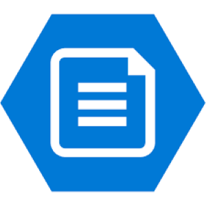
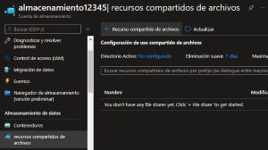
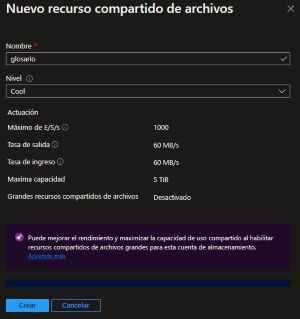
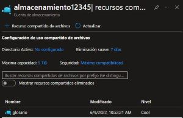
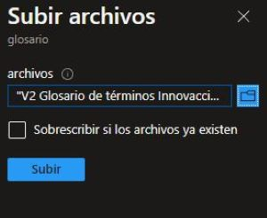
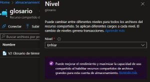
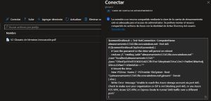
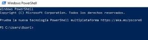
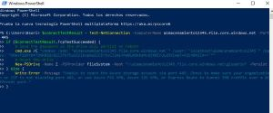

# DATOS Y ALMACEN

**Storage: Proporciona servicios de almacenamiento de archivos y objetos.**

### Cuenta de Almacenamiento de Azure

- **Modelo de servicio:** IaaS.
- **Caracteristicas:** Seguridad, alta, disponibilidad, durabilidad y escalabilidad.

La cuenta de almacenamiento de es la que contiene todos los objetos de los demas servicios.

-----------------------------------------------------------------------------------

## Azure File Storage

Almacena archivos mas pequeños, controla mejor su acceso, archivos mas privados o tambien para migrar de un ambiente local a Azure.

Controla mejor los archivos, funciona como disco duro de todas las maquinas virtuales.

- **Modelo de servicio:** IaaS.
- **Funcion:** Para compartir archivos y controlar su acceso.
- **Funcion:** Facilita la migracion de local a Azure.
- **Funcion:** Acceso de archivos desde varias maquinas virtuales.
- **cuando usar:** Compartir datos a traves del mundo.

---------------------------------------------------

#### Pasos para crear un File Storage

1.- Abrimos el [Portal Azure](https://portal.azure.com/)

2.- Nos vamos al almacen que tenemos creado

3.- Nos vamos a la parte de recursos compartidos de archivos

4.- Creamos un recurso compartido de Archivos

5.- Entramos al recurso llamado *glosario*

6.- Una ves dentro del recurso, subiremos un archivo 

7.- Iremos subido el archivo y tambien, podremos cambiar el nivel en caso de necesitarlo.

8.- Si queremos conectar el recurso desde  windows osea nuestra propia maquina, debemos darle en conectar y copiar ese comando que nos da.

9.- Ahora abrimos PowerShell Windows.

10.- Copiamos el codigo y le damos enter

11.- Para que esto funcione, debes de tener activada tu sesion en tu computadora y en azure, debe ser la misma.

12.- Podemos crear carpetas, eliminar, agregar,etc.

13.- Desde aqui podemos contralar cada uno de los recursos,controlar el acceso,podemos modificar o  conectarnos a este recurso de file storage.

-----------------------------------------------------------------------------------
